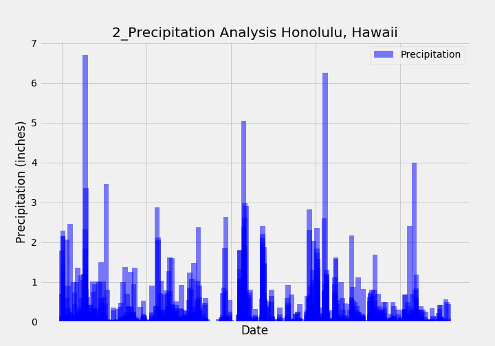
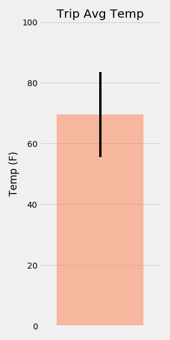
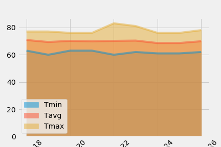

# Climate Analysis 

Hawaii climate analysis using SQLAlchemy.

## Purpose 

Used Python and SQLAlchemy to perform climate analysis and data exploration of Honolulu, Hawaii climate database [hawaii.sqlite](Resources/hawaii.sqlite)

## Tools Used
Jupyter Notebook, Python, SQLAlchemy ORM queries, Pandas, and Matplotlib.

## Methodology
* Files:
    - climate_analysis.ipynb - reads the sqlite database, performs analysis on the data, and generates graphs.

* Precipitation Analysis:
    - Designed query to retrieve the last 12 months of precipitation data (selecting date and prcp values).
    - Plotted results using the DataFrame plot method.
* Station Analysis:
    - Designed query to retrieve the last 12 months of temperature observation data (tobs).
    - Filtered by the station with the highest number of observations.
    - Ploted the results as a histogram with bins=12.
* Temperature Analysis: 
    - Calcutated the min, max, avg temperatures for trip dates, and plotted results on bar chart.
        * Used the average temperature as the bar height.
        * Used the peak-to-peak (tmax-tmin) value as the y error bar (yerr).
* Daily Rainfall Analysis 
    - Calculated the rainfall per weather station using the previous year's matching dates.
    - Calculated the daily normals. Normals are the averages for the min, avg, and max temperatures.
        * Use Pandas to plot an area plot (stacked=False) for the daily normals.
    
## Findings

<table>
  <tr>
    <td>Precipitation Analysis</td>
  </tr>
  <tr>
    <td valign="top"></td>
   
  </tr>
 </table>

<table>
  <tr>
     <td>Station Analysis</td>
  </tr>
  <tr>
    <td valign="top"></td>
  </tr>
 </table>

<table>
  <tr>
    <td>Temperature Analysis</td>
     <td>Daily Rainfall Analysis</td>
  </tr>
  <tr>
    <td valign="top"></td>
    <td valign="top"></td>
  </tr>
 </table>
 